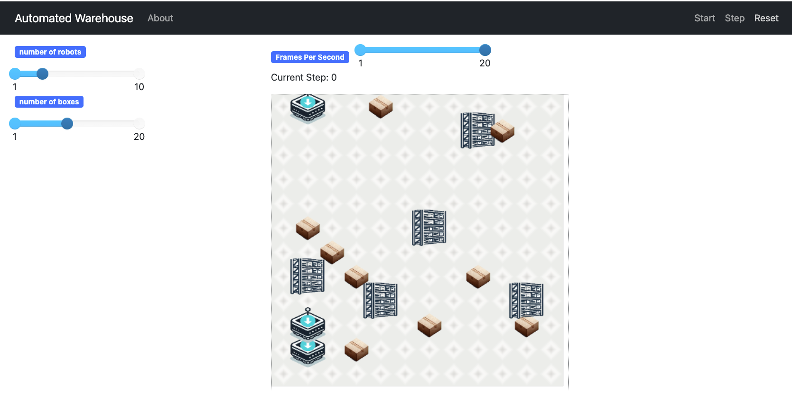

# **ABM Warehouse**: An Automated Warehouse Simulation Environment

[](https://doi.org/10.5281/zenodo.10971674)




Robots are being used in warehouses to support multiple activities. For example, [Amazon has deployed a multiple type of robots in its warehouses](https://www.youtube.com/watch?v=7SvTdW4OLUQ). Some of these robots are able collect items across the warehouse and bring them closer to the human operators stations. This way the operators do not need to carry heavy load and robots can quickly find the required items across the facilities.

An early generation of this type of robots is presented in operation here [video](https://www.youtube.com/watch?v=Ox05Bks2Q3s).

Inspired in the way that these robotised warehouses work, this repository provides boilerplate implementation of an ABM (Agent-based Model) of a warehouse where robots are used to carry boxes. 

This environment intends to provide researchers and practitioners with a rapid prototyping and proof-of-concept environment for algorithms applied in this domain.

# Installation

*ABM Warehouse* is implemented on top of [Mesa platform](https://mesa.readthedocs.io/en/stable/), particularly tested on version `2.1`. 

Simply install mesa by using `pip`:

```python

     pip install mesa==2.1

```

# Possible use cases

Practical simulation environment in the context of warehouse operations for the rapid prototyping and proof-of-concept of:

* Navigation algorithms
* Coordination and cooperation algorithms
* Knowledge representation 
* ...

Likewise *ABM Warehouse* works as an introductory learning environment for concepts related to autonomous agents and multiagent systems. 

# Contributors

* [Marco Perez Hernandez](https://marcoph.org)

# Acknowledgement

Icons used here were created with the assistance of DALL·E 2. Code and code documentation also AI assisted.

# Citing this work

``
Perez Hernandez, Marco (2024). ABM Warehouse: An Automated Warehouse Simulation Environment. Version 1. University of The West of England (UK). https://doi.org/10.5281/zenodo.10971674. Accessed 2024-04-14.``